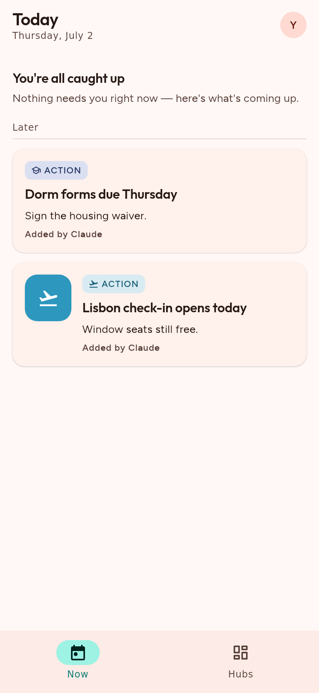
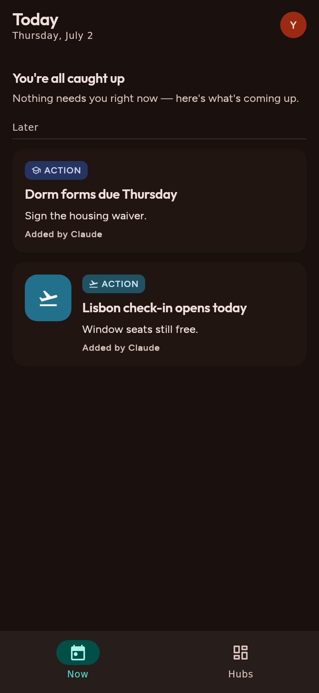
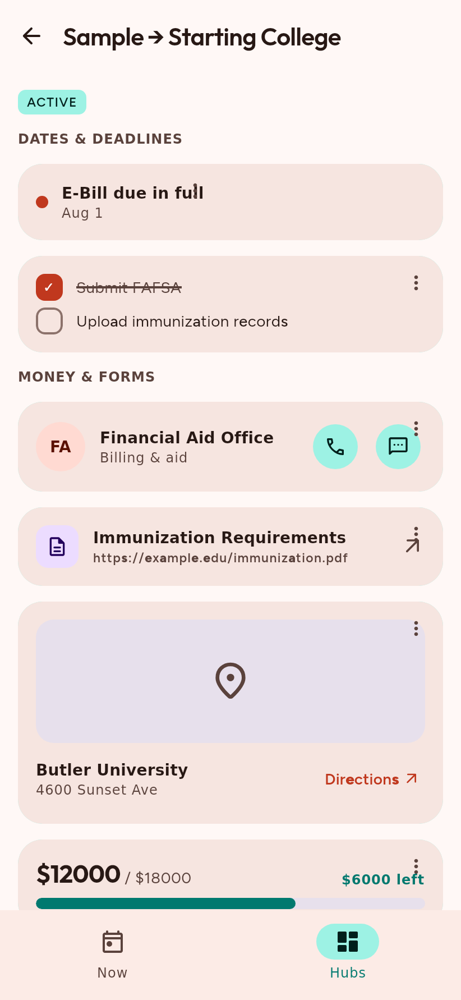

# Dayfold

A calm, AI-powered household dashboard: one daily **briefing** plus a short
list of **smart recommended actions** with deep links ("party Saturday —
ordered groceries? [list]"; "rain at soccer 4pm — pack jackets"), rendered
mobile-first on Compose Multiplatform. Content is authored externally — by
the operator or an AI loop, via a CLI + Claude skill — not generated by an
in-app chatbot. Full framing (what it is / isn't, scope, MVP boundaries):
[CLAUDE.md](CLAUDE.md).

> **Status:** the planning loop is running (Phase A — validation follow-through)
> **and the M0 prototype is built + live.** The content API runs on Vercel + Neon,
> the `dayfold` CLI authors content, and the Android app renders it on-device —
> the full wedge works end-to-end (Google sign-in → CLI device-login → author a
> hub → it renders on the phone). Validation round 1 verdict: **CONDITIONAL —
> learning-lab GO, standalone-business NO-GO** (the generic "AI family briefing" is
> commoditized by Gemini Daily Brief / Alexa+ and funded verticals; the defensible
> surface is a **multi-member family-tenant briefing**). See
> `research/validation-round1-2026-06.md`, `adr/0004`, and
> `specs/prototype/00-build-spec-plan.md`.

## Screenshots

Rendered straight from the app's own golden-snapshot test suite (Compose
Multiplatform, Material 3 Expressive) — light and dark, Now feed and Hub
detail:

  

These are CI-verified golden images (131 snapshots gate every PR, ADR 0019),
so they stay accurate as the UI evolves — not hand-picked marketing shots.
Early on-device proof that the CLI → cloud DB → render loop works end-to-end
on a real Pixel: [`specs/prototype/g1a-pixel10-cloud.png`](specs/prototype/g1a-pixel10-cloud.png).
For the full design system and every screen, see the hi-fi mockups in
[`designs/`](designs/).

## Orientation

- [CLAUDE.md](CLAUDE.md) — session protocol, governance, directory map
- [docs/architecture.md](docs/architecture.md) — system diagram, components, data flow, auth, deploy
- [CHANGELOG.md](CHANGELOG.md) — dated log of product/API/feature changes
- [context/values-and-direction.md](context/values-and-direction.md) — operator-owned north star
- [context/business-constitution.md](context/business-constitution.md) — identity + scope firewall (what it is NOT)
- [adr/0004-product-framing.md](adr/0004-product-framing.md) — what this is, what it isn't, MVP scope
- [research/validation-round1-2026-06.md](research/validation-round1-2026-06.md) — validation verdict + evidence
- [planning/workstreams.md](planning/workstreams.md) — the live waterfall board
- [backlog/operator-inbox.md](backlog/operator-inbox.md) — items awaiting the operator
- [backlog/now.md](backlog/now.md) — current immediates

## Repository

| Path | What |
|---|---|
| `apps/api` | Content API — TypeScript / Hono / Postgres (Neon), on Vercel. Auth (token mint, device-grant RFC 8628, Firebase verify), hubs + cards, scope + per-hub visibility. |
| `apps/client` | Compose-free KMP core (ADR 0047) — reducers, engines, sync/data, redux-kotlin store, SQLDelight offline cache. Android/iOS/desktop logic, no UI. |
| `apps/ui` | Compose Multiplatform UI (ADR 0047) — the feed + hub renderer + iOS framework target; depends on `:client`. |
| `apps/androidApp` | Android host — the dogfood target. |
| `apps/iosApp` | iOS host (SwiftUI/xcodegen) embedding the `:ui` framework — notification parity with Android (ADR 0044 Phase B). |
| `apps/cli` | The `dayfold` CLI (Kotlin) — `login` · `push` · `pull` · `template` · `delete` · `whoami` · `update`; authors content into the API (`push --type` runs local structural validation before every network call). |
| `packages/schema` | Generated content schema (`content.schema.json` → Kotlin/TS) — the card/hub contract. |
| `packages/linkrules` | Shared Kotlin (`commonMain`) srcdir'd into CLI + client — link/URL vetting, the ULID minter, media validation. |

- **Build & run the apps:** `processes/agent-dev-loop.md` (fixed toolchain + the cheap
  feedback loop) and `specs/prototype/00-build-spec-plan.md` (the live M0).
- **Author content (CLI + Claude):** `apps/cli/templates/README.md` — the typed-authoring
  doc for both cards and hub trees, plus the markdown the app renders.

## Running the planning loop

- One-shot: open a session here and say **"run a loop iteration"** (follows
  `processes/planning-loop.md`).
- Sweep `backlog/operator-inbox.md` weekly.

## Lineage

Built from the **venture-loop template** (extracted from the KeepQR /
RevenueCatch projects). Process inspiration also drawn from the sibling
`ambient-ai` spec repo ("render, don't reason"; ADR + open-questions
discipline; persona-driven key moments).

## Curator skill (Claude Code)

`.claude/skills/dayfold-curator/` is the authoring wedge — a Claude Code skill
that analyzes your context, runs an onboarding questionnaire, and authors dayfold
Hubs + BriefingCards through the `dayfold` CLI (propose-confirm before every push).

Install globally (all projects on this machine):

```
sh .claude/skills/dayfold-curator/install.sh
```

Or per-project: copy `.claude/skills/dayfold-curator/` into another repo's
`.claude/skills/`. Requires `dayfold` on PATH and `dayfold login` done first.
