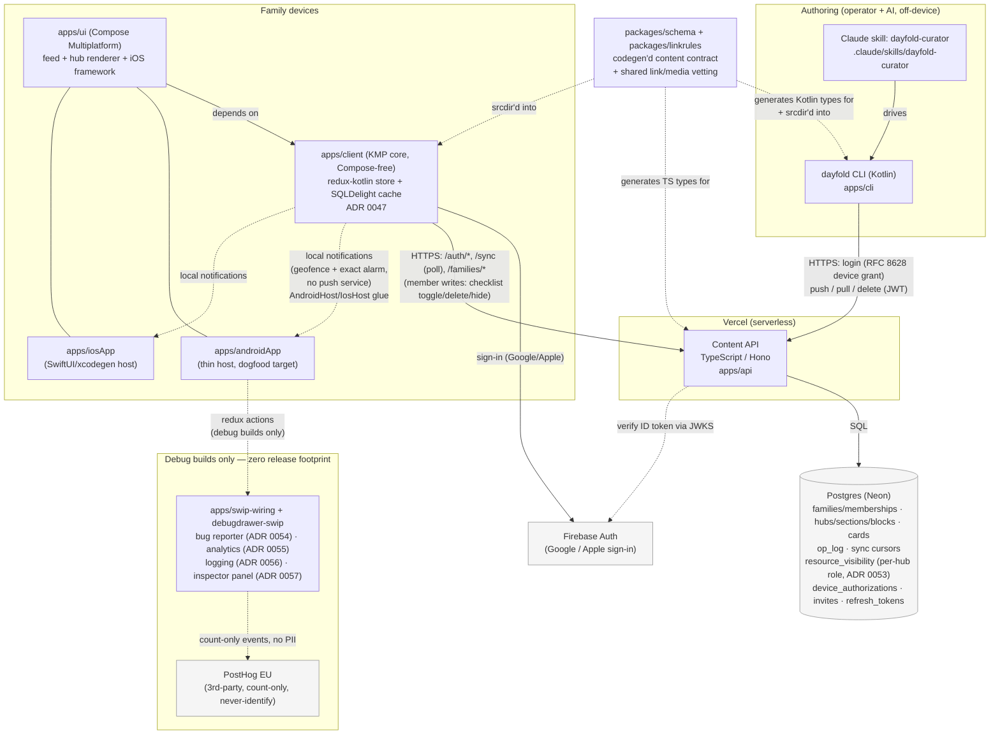

# Architecture

A map of the system as it actually runs today (2026-07-13). For product framing
see `README.md` / `adr/0004-product-framing.md`; for decisions see `adr/`; for
live build status see `backlog/now.md`. This file is descriptive (what's built),
not a design doc — update it when a component's shape changes, not on every PR.

## System overview

**Server-blind, client-rendered.** The API stores and moves typed JSON; it does
not interpret content or rank anything. All "smart" behavior (the Now feed's
priority engine, notification selection, geofencing) runs **on-device** in
`apps/client` commonMain, over data already synced. This keeps the server dumb
by design (`adr/0007-prototype-scope.md`) and location data device-local
(ADR 0044) — see Data flow below.

## Components

| Component | Path | Stack | Role |
|---|---|---|---|
| Content API | `apps/api` | TypeScript, Hono, `pg`, Zod, deployed on Vercel | Auth (mint/verify tokens, device grant, Firebase verify), family/membership CRUD, hub/card/section/block CRUD with visibility + author-gate enforcement, `/sync` cursor feed, cron sweep (tombstone GC) |
| Database | Postgres (Neon, pooled) | — | System of record: families, memberships, credentials, hubs/sections/blocks, briefing_cards, `op_log` (idempotency), `resource_visibility` (incl. per-hub `role` — viewer/contributor/co_owner, ADR 0053), `device_authorizations`, `invites`, `refresh_tokens` |
| CLI | `apps/cli` | Kotlin, hand-rolled `java.net.http.HttpClient` (no framework) | `login` (device grant + OS keychain) / `push` / `pull` / `delete` / `template` / `whoami` / `update` — the authoring surface for operators and AI loops |
| Curator skill | `.claude/skills/dayfold-curator` | Claude Code skill (Markdown + `install.sh`) | Turns a person's context (email/calendar/notes) into Hubs + BriefingCards via the CLI, propose-confirm before every push/delete |
| Client core | `apps/client` | Kotlin Multiplatform (ADR 0047: Compose-free) | `commonMain` logic: sync engine, offline cache (incl. a local-only cached-membership table for the DB-first cold-start route gate, ADR 0052), the Now priority/ranking engine, notification selection, redux-kotlin store. Targets: Android, desktop (dev/test), iOS |
| UI | `apps/ui` | Compose Multiplatform, depends on `:client` (ADR 0047) | Feed/hub/detail rendering, screens, theme, the CL-SNAP golden-snapshot harness; also hosts the iOS framework build target |
| Android host | `apps/androidApp` | Thin Android app depending on `:ui`/`:client` | The dogfood install target; owns the manifest + calls into `:client`'s `androidMain` notification/geofence glue (`AndroidLocalNotifier`, `AndroidGeofenceController`, `AndroidExactNotificationScheduler`) |
| iOS host | `apps/iosApp` | SwiftUI/xcodegen, embeds the `:ui` static framework | Notification parity with Android (ADR 0044 Phase B) via `:client`'s `iosMain` glue (`IosLocalNotifier`, `IosGeofenceController`, `IosExactNotificationScheduler`) over the same shared `commonMain` core |
| Debug drawer | `apps/debugdrawer`, `debugdrawer-noop`, `debugdrawer-redux`, `debugdrawer-swip` | Compose-MP library modules | In-app devtools bubble/drawer (action log, redux state inspector); `-noop` variant is the release no-op, gated to debug builds. `-swip` (ADR 0057) adds a live, mask-by-default analytics timeline panel fed by the SWIP capture engine's ring buffer — `debugImplementation`-only, zero release bytes |
| SWIP wiring | `apps/swip-wiring` | KMP library consuming the published SWIP SDK (`works.sloop.swip:*`) | The SWIP privacy floor + the seam that keeps `:client` SWIP-free: the bug-reporter slice registry + `dayfoldSanitizer` (ADR 0054) and the analytics mapper table + `NoOpErrors` (ADR 0055), plus the mandatory salted-PII leak test (`:swip-wiring:desktopTest`, a CI gate). Consumed `debugImplementation`-only by `:androidApp` (debug/internal builds) |
| Logging | `Log` front-door in `:client` (`com.sloopworks.dayfold.client.Log`, ADR 0056), bound to SWIP `SloopLogging` in `:androidApp`'s debug glue | `:client` = SWIP-free leveled facade; `swip-logging:0.1.1` debug-only | Leveled (debug/info/warn/error) engine milestone logging → console + devtools drawer, debug builds only; PII-scrubbed ahead of every writer, on-device only, zero swip bytes in release |
| Schema | `packages/schema` | `content.schema.json` → generated Zod (API) + Kotlin (`Content.kt`, shared by CLI/client) | The single content contract; CI fails if generated output is stale |
| Shared Kotlin | `packages/linkrules` | Kotlin (`commonMain`, no platform deps) | Srcdir'd into both CLI and client so authoring and rendering never drift: phone/email linkification + URL/mailto vetting, the ULID minter (ADR 0038), and hardened image/icon/accent validation (ADR 0036, mirrored in `apps/api/src/media-validation.ts`) |

## Data flow

1. **Author.** Operator or an AI loop runs the `dayfold` CLI (often via the
   curator skill) to `push` a Hub/Section/Block/BriefingCard as JSON. The CLI
   locally structure-checks it, then `PUT`s to the API with a bearer JWT.
2. **Store.** The API validates (Zod schema + visibility/audience rules +
   author-gate), stamps provenance, and upserts into Postgres. Soft-deletes
   (`deleted_at`) back both card/hub deletes and the two-way member-write
   tombstones; a cron sweep hard-purges tombstones past the retention floor
   (`CONTENT_TOMBSTONE_RETENTION_DAYS`, default 90).
3. **Sync.** Each client polls `GET /families/:fid/sync` (~45s foreground,
   resume-on-foreground) with a 3-part cursor; the API returns a page of
   deltas. A stale cursor (older than the tombstone floor) gets
   `full_resync:true` and a full rebuild.
4. **Cache + render.** The client writes deltas into its local SQLDelight DB
   (single writer, WAL), which is the *only* thing the redux store reads from
   (`network → DB → store → UI`, never network → store directly). The Now feed
   is computed on-device from cached content (`rank()` in `NowRank.kt`) —
   urgency/proximity/importance/decay, calm-budget banding, local-only
   surfacing state (`last_shown`/`dismissed`, never synced). A hub can also
   render a **timeline** (day rail or multi-month roadmap): authored via
   `Hub.timeline` (content-blind, laid out entirely on-device), or — when a
   hub has none — **derived on-device** from its own dated blocks (checklist
   due-dates, milestones, pickups), honestly labelled as derived (ADR 0045,
   0046).
5. **Member writes (two-way, ADR 0038–0042).** A signed-in member can toggle a
   checklist item, delete their own block, or hide a block locally. These go
   through an **outbox** (optimistic apply → `PUT`/`DELETE` with
   `If-Match`/Idempotency-Key → drain on reconnect), not the read-only sync
   path. Author-gated (`created_by`), scoped to `content:write` /
   `content:delete`. Section/block writes into someone else's hub additionally
   require a per-hub **role** — Viewer (read-only), Contributor (write),
   Co-owner (write + manage people) — checked independently of the ADR 0029
   scope string; a hub's author is always an implicit, non-removable Co-owner
   (ADR 0053). Hub People management (add/remove/set-role) is its own screen.
6. **Background notifications (ADR 0044, Phase B).** On Android, a background
   pass re-runs the *same* `rank()`/notification-selection code the foreground
   feed uses, over the on-device cache plus live (never-persisted) location, to
   decide whether to fire a **local** notification (geofence enter or exact
   alarm) — quiet-hours + daily-cap device-local config, never synced. There is
   no push service (no FCM/APNs) and no server involvement in this path.
7. **Cold start (ADR 0052).** The top-level route gate is DB-first, mirroring
   content: family memberships are cached in a local-only SQLDelight
   `membership` table (alongside `hidden`/`surfacing_state`/`notif_config`) and
   read synchronously in `AuthEngine.restore()`. A saved token + cached
   membership routes straight to `Route.Feed` from disk — no network wait — and
   `whoami` reconciles in the background (success overwrites+persists; 401
   signs out and clears the cache; offline keeps the cached dashboard instead
   of an error). First launch after install, with nothing cached, is unchanged
   (network-gated). Warm start is unaffected (no splash, route already `Feed`).
8. **Product analytics (ADR 0055, debug builds only).** A dispatched redux
   action passes through a `:swip-wiring` mapper table (the tracking spec —
   unmapped actions emit nothing), then `swipMiddleware` (composed into the
   single debug-only `createAppStore(extraEnhancer)` slot alongside the ADR
   0054 bug recorder), then the SWIP pipeline, to PostHog EU. Count-only
   8-event slice 1, no PII, geoip disabled at the transport, analytics id
   never linked to an account (`identify()` is never called). `:client`
   imports no `works.sloop.swip`; the release APK carries zero analytics
   bytes (inert `src/release` glue, same idiom as the bug recorder). Events
   flush on backgrounding (not just the 30s/30-event timer) and persist to an
   on-device SQLite durable queue (WAL) so a process kill mid-batch doesn't
   strand them — resumes on next launch. A debug-only **inspector panel**
   (ADR 0057, in the debug drawer) shows this pipeline's live send/drop
   timeline, mask-by-default with tap-to-reveal.

## Auth

- **Identity:** Firebase (Google/Apple sign-in) verified server-side via JWKS,
  or a gated `/auth/dev-token` path for local dev (refuses outside
  dev/preview).
- **Tokens:** the API mints its own short-lived EdDSA access tokens + longer
  refresh tokens (`/auth/refresh`, ~20s reuse grace for race tolerance),
  independent of the identity provider.
- **CLI device login:** RFC 8628 device-authorization grant (`/device/*`) — the
  CLI prints a code, the family owner approves it in the app, the CLI polls and
  lazily mints a token. Refresh tokens live in the OS keychain (headless/CI
  fallback: a 0600 file via `--allow-env-key`).
- **Tenancy:** every content route is scoped to a `familyId`; cross-family
  access is a 404 (no existence oracle), not a 403.
- **Legacy path:** a static `HOUSEHOLD_SECRET` bearer still works on content
  routes for pre-auth-epic compatibility; new work should assume real auth.

Full design/decision record: `adr/0011` (auth architecture), `adr/0021`
(build-order), `adr/0027` (Firebase JWKS), `adr/0029`/`0030` (scope + hub
visibility), `adr/0038`–`0042` (two-way member writes), `adr/0043`/`0044` (Now
derived surfacing + background notifications), `adr/0045`/`0046` (Hub
Timeline — authored + on-device-derived), `adr/0052` (DB-first cold-start
route gate), `adr/0053` (per-hub participation roles), `adr/0055` (SWIP
product analytics — debug-only, PostHog EU, count-only), `adr/0057` (SWIP
debug inspector panel).

## Deploy

- **API:** bundled with esbuild (`npm run build:fn` → `apps/api/api/index.js`)
  and deployed to Vercel (`vercel deploy --prod`). Prod DB is Neon (pooled
  connection). `npm run preflight` (`env:check` + `db:check`) gates a redeploy
  against missing env or schema drift.
- **CI** (`.github/workflows/ci.yml`): API tests against a live Postgres
  service container, client desktop tests + Compose snapshot tests, codegen +
  bundle drift guards, expect/actual parity check for KMP targets. Runs on
  every push to `main` and on pull requests.
- **CLI:** Homebrew tap distribution is spec'd (`release-cli.yml`,
  `release-cli-edge.yml`) but gated on a licensing decision (ADR 0031/0032,
  operator + counsel) before the first tagged release.
- **Android:** `release-android.yml` is the Play-track release pipeline,
  gated on secrets.

## Logging

`:client` exposes a leveled `Log` front-door (debug/info/warn/error, lazy
inline messages) that stays SWIP-free by design (ADR 0056) — an unbound
`sink` falls back to `println` so bare `:client`/`desktopTest` still print.
`:androidApp`'s **debug** build binds `Log.sink` to the SWIP `SloopLogging`
runtime (console + the in-app devtools drawer writer); the release variant
never links swip. SloopLogging's PII scrubber runs ahead of every writer —
callers pass ids/counts/enums/outcomes, never raw tokens/emails/names — and
the same scrub now also runs on the ADR-0054 bug-reporter's breadcrumb ring.
Everything stays on-device; there is no log-upload path. See ADR 0056.

## What's out of scope today

- No push notifications service (FCM/APNs) — background notifications are
  local-only (ADR 0044).
- No E2EE (ADR 0017, deferred to M1) — content is plaintext at rest.
- No direct Gmail/Calendar OAuth server-side (restricted-scope CASA cost
  avoidance, `CLAUDE.md` guardrail 3) — email/calendar signals reach dayfold
  only via the operator/AI authoring loop, not a live integration.
- No web target shipped (KMP `wasmJs` is unblocked but the client's DB layer
  needs a sync→async migration first — see `backlog/next.md`).
- iOS is sim-verified, not device/App-Store-shipped (background/killed-state
  wake paths need a real device; App Store background-location justification
  is operator/legal-gated).
